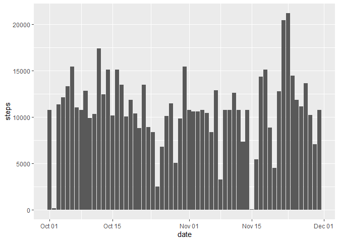
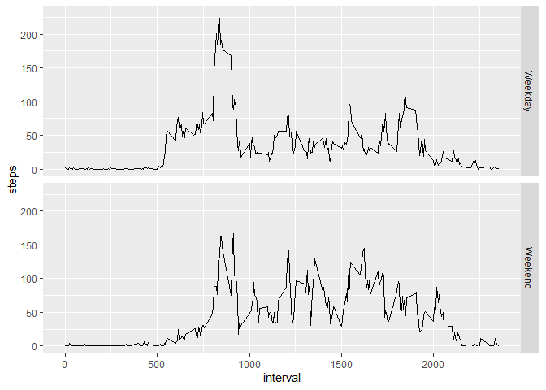

## Loading and preprocessing the data

```r
library(ggplot2)
activity <- read.csv(unz("activity.zip", "activity.csv"))
activity$date <- as.Date(activity$date)
```

## What is mean total number of steps taken per day?

```r
## Plot histogram of steps
t <- data.frame(tapply(activity$steps, activity$date, sum),
           unique(activity$date))
colnames(t) <- c("steps", "date")
g <- ggplot(t,aes(date,steps))+geom_histogram(stat="identity")
```

```
## Warning: Ignoring unknown parameters: binwidth, bins, pad
```

```r
g
```

```
## Warning: Removed 8 rows containing missing values (position_stack).
```

<!-- -->

```r
## Calculate median and mean of steps
mean <- mean(na.omit(t$steps))
median <- median(na.omit(t$steps))
```

The mean total number of steps taken per day is ``10766.19``.  
The median total number of steps taken per day is ``10765``.

## What is the average daily activity pattern?

```r
## Time series plot of the average steps for each time interval
s <- activity[which(!is.na(activity$steps)),-2]
s <- data.frame(tapply(s$steps, s$interval, mean), unique(s$interval))
colnames(s) <- c("steps", "interval")
g <- ggplot(s, aes(interval, steps)) + geom_line()
g
```

<!-- -->

```r
## Find maximum average steps
max <- s[which(s$steps==max(s$steps)),]
```

The 5-minute interval with the highest number of steps (averaged across all days) is ``835`` with an average of ``206.1698113`` steps.

## Imputing missing values


```r
## How many missing values?
total.na <- sum(is.na(activity))

## Strategy for filling in missing values
p <- activity
nas <- which(is.na(p))
p <- cbind(p, rep(s[,1], 61))
p[nas,1] <- p[nas,4]
p <- p[,1:3]

## Histogram of the new dataset, without NAs
t <- data.frame(tapply(p$steps, p$date, sum), unique(p$date))
colnames(t) <- c("steps", "date")
g <- ggplot(t,aes(date,steps))+geom_histogram(stat="identity")
```

```
## Warning: Ignoring unknown parameters: binwidth, bins, pad
```

```r
g
```

<!-- -->

```r
## Calculate median and mean of steps
mean2 <- mean(t$steps)
median2 <- median(t$steps)
```

There are ``2304`` rows with missing values in the dataset.  
The strategy for imputing NAs replaces each NA value with the mean value of steps for that 5 minute time interval.  
The mean total number of steps taken per day is ``10766.19``.  
The median total number of steps taken per day is ``10766.19``.  
The median is slightly different, but the mean has stayed the same. Interestingly, the mean and median are now equal.

## Are there differences in activity patterns between weekdays and weekends?


```r
## Split each row by factor variable, weekend or weekday
week <- p
week <- cbind(week, weekdays(week[,2]))
weekends <- which(week[,4] %in% c("Saturday","Sunday"))
week[,4] <- "Weekday"
week[weekends,4] <- "Weekend"
week <- split(week, week[,4])

## Time series plot of the average steps for each time interval
weekday <- data.frame(tapply(week[[1]]$steps, week[[1]]$interval, mean), unique(week[[1]]$interval), week[[1]][,4])
```

```
## Warning in data.frame(tapply(week[[1]]$steps, week[[1]]$interval, mean), :
## row names were found from a short variable and have been discarded
```

```r
weekend <- data.frame(tapply(week[[2]]$steps, week[[2]]$interval, mean), unique(week[[2]]$interval), week[[2]][,4])
```

```
## Warning in data.frame(tapply(week[[2]]$steps, week[[2]]$interval, mean), :
## row names were found from a short variable and have been discarded
```

```r
colnames(weekday) <- c("steps", "interval", "week")
colnames(weekend) <- c("steps", "interval", "week")
week <- rbind(weekday, weekend)
g <- ggplot(week, aes(interval, steps)) + geom_line()
g + facet_grid(rows=vars(week))
```

<!-- -->
